```{r, echo=FALSE, message=FALSE}
library(learnr)
library(ggplot2)
library(dplyr)
library(gradethis)
library(rmarkdown)
library(knitr)
library(digest)
library(bitops)
library(yaml)
library(shiny)
library(ggpubr)
knitr::opts_chunk$set(exercise.checker = gradethis::grade_learnr)
```

```{r setup1, echo=FALSE, message=FALSE}

setwd("C:/Users/cbolc/Desktop/stories/_bird")
cat_species_df <- read.csv('C:/Users/cbolc/Desktop/stories/data/cat_species.csv')

```

```{r setup2, echo=FALSE, message=FALSE}

#setwd("C:/Users/cbolc/Desktop/_bird")
statcat_rich_df <- read.csv('C:/Users/cbolc/Desktop/stories/data/statcat_rich.csv')
datadog_ha_df <- read.csv('C:/Users/cbolc/Desktop/stories/data/datadog_ha.csv')

```

```{r setup3, echo=FALSE, message=FALSE}

#setwd("C:/Users/cbolc/Desktop/_bird")
statcat_rich_df <- read.csv('C:/Users/cbolc/Desktop/stories/data/statcat_rich.csv')
datadog_ha_df <- read.csv('C:/Users/cbolc/Desktop/stories/data/datadog_ha.csv')
statcat_datadog_df <- merge(statcat_rich_df, datadog_ha_df, by = c("site", "block", "elevation", "habitat"))

```

```{r setup4, echo=FALSE, message=FALSE}

#setwd("C:/Users/cbolc/Desktop/_bird")
statcat_rich_df <- read.csv('C:/Users/cbolc/Desktop/stories/data/statcat_rich.csv')
datadog_ha_df <- read.csv('C:/Users/cbolc/Desktop/stories/data/datadog_ha.csv')
statcat_datadog_df <- merge(statcat_rich_df, datadog_ha_df, by = c("site", "block", "elevation", "habitat"))

```

<style>
body {background: url("images/gradient.png") repeat-x fixed}
</style>

## <font style="font-size:0px">Title Page</font>

###

<div style="padding: 10px;padding-bottom: 0;margin-bottom: 20px;border: thin solid #8FBE70;border-left-width: 25px;background-color: #fff">
<p><strong>Learning Objectives:</strong></p>
<ul>
<li>1 &#8211; Students will be able to demonstrate their knowledge of the process of data collection.</li>
<li>2 &#8211; Students will be able to create visualizations to look at the relationship among the variables of species richness, area of habitat, and habitat types.</li>
</ul>
</div>

<p style="text-align: center; font-size:x-large;"><strong>Click Continue to Begin!</strong></p>

## Chapter 1

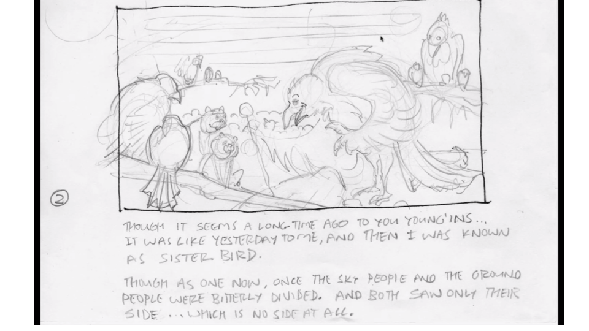{width=867px; height=500px}

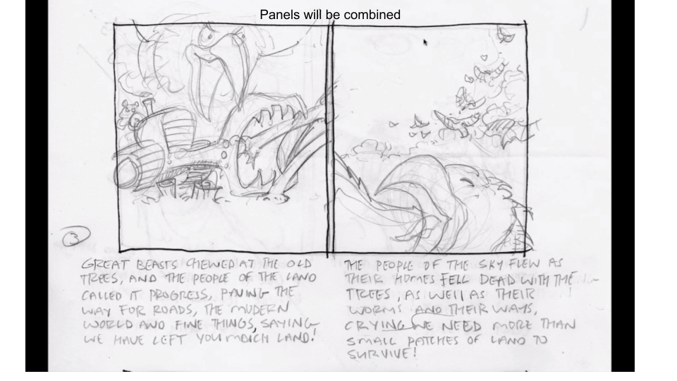{width=867px; height=500px}

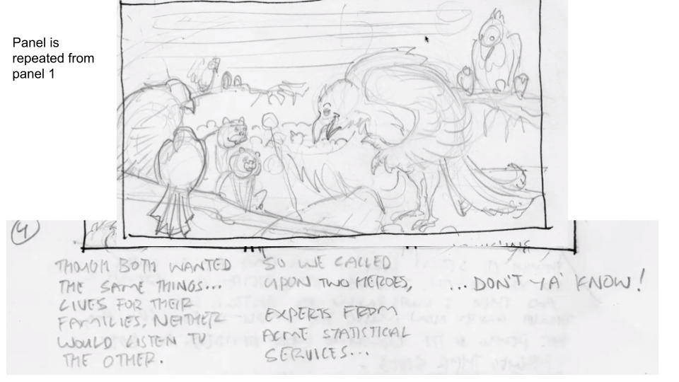{width=867px; height=500px}

{width=867px; height=500px}

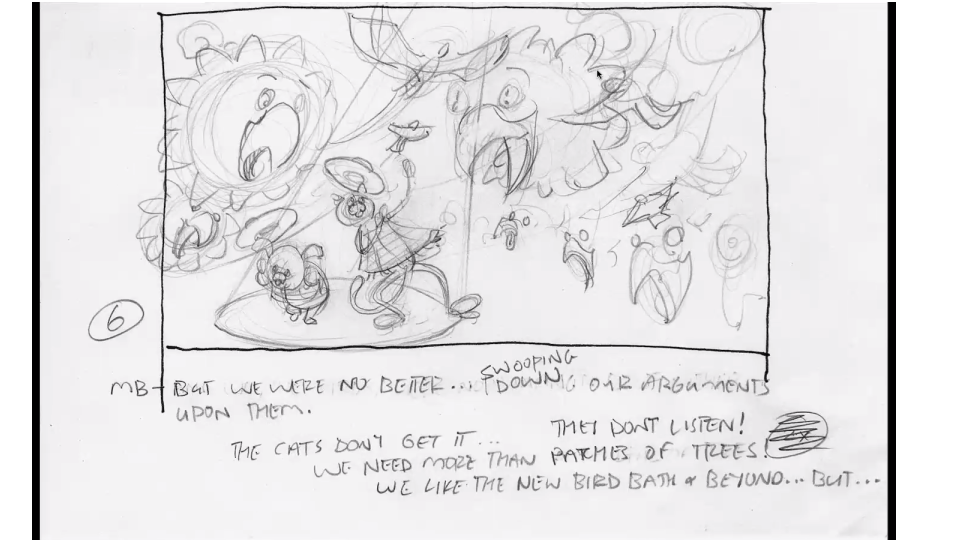{width=867px; height=500px}

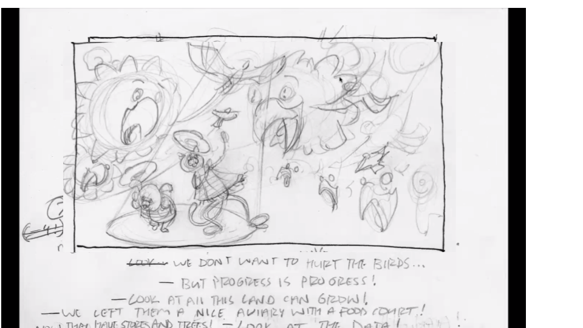{width=867px; height=500px}

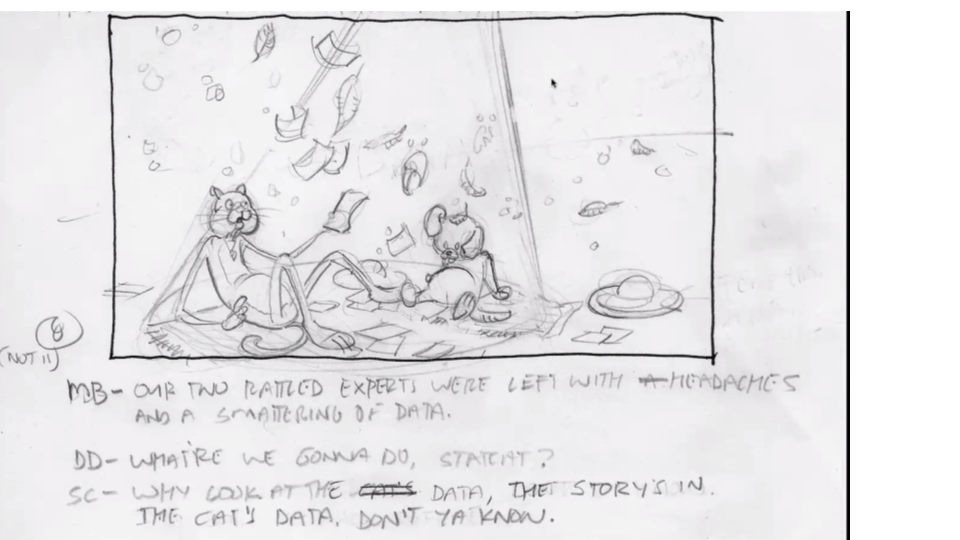{width=867px; height=500px}

<strong>Before StatCat and DataDog go out into the field to collect the data, they would like to look at the data that has already been collected by the cats.Statcat has the data provided to him and he is interested in looking at the different habitat types. He first needs to load the relevant packages and read the data into R.</strong>

```{r example1, exercise=TRUE, exercise.setup="setup1", exercise.lines=10, message=FALSE, warning=FALSE}


#Download and load in the data as
cat_species_df <- read.csv('C:/Users/cbolc/Desktop/stories/data/cat_species.csv')

#Look at the first 6 rows of data
head(cat_species_df)

```

```{r example2, exercise=TRUE, exercise.setup="setup1", exercise.lines=10, message=FALSE, warning=FALSE}

#table of habitat types
counts_habitat <- table(cat_species_df$habitat)
counts_habitat

#bar graph of table
barplot(counts_habitat,
        main = "Counts of Habitat Types",
        xlab = "Habitat Types",
        ylab = "Count",
        ylim = c(0,30))

```

<strong> Comprehension Questions </strong>
```{r example3, exercise=TRUE, exercise.lines=5, message=FALSE, warning=FALSE}

#Question 1
#What habitat type is the largest?


```

```{r example3-solution}

#The largest habitat type is fragments. 

```

```{r example4, exercise=TRUE, exercise.lines=8, message=FALSE, warning=FALSE}

#Question 2
#What type of habitat do you think fragments are?


```


## Chapter 2

{width=867px; height=500px}

{width=867px; height=500px}

{width=867px; height=500px}

{width=867px; height=500px}

<strong>StatCat and DataDog see that they need more data which sets up the framing for the research questions.</strong>

<div style="padding: 10px;padding-bottom: 0;margin-bottom: 20px;border: thin solid #8FBE70;border-left-width: 25px;background-color: #fff">
<p><strong>Research Questions:</strong></p>
<ul>
<li>1 &#8211; What is the relationship between species richness and habitat types (forest, shrubs, trees, fragments, etc.)?</li>
<li>2 &#8211; What is the relationship between species richness and area for all habitats?</li>
<li>3 &#8211; What is the relationship between species richness and area for specific habitats of interest?</li>
</ul>
</div>

<strong>StatCat thinks that looking at the types of species and the habitat types (research question 1) will give him a better idea of what is going on in the data. DataDog decides to collect data with the birds about the size of the habitat areas.</strong>


<strong> DataDog: So what do we need to do to collect this data? StatCat: Here is the additional data we must collect!</strong>

<div style="padding: 10px;padding-bottom: 0;margin-bottom: 20px;border: thin solid #8FBE70;border-left-width: 25px;background-color: #fff">
<p><strong>Data Collection Variables:</strong></p>
<ul>
<li>1 &#8211; Site</li>
<li>2 &#8211; Block</li>
<li>3 &#8211; Elevation</li>
<li>4 &#8211; Habtitat Type</li>
<li>5 &#8211; Ha (size of habitat area)- DataDog is collecting</li>
<li>6 &#8211; Richness- StatCat is collecting</li>
</ul>
</div>


```{r example5, exercise=TRUE, exercise.setup="setup1", exercise.lines=10, message=FALSE, warning=FALSE}

#The setup of the data collection form is important to plan out before 
#StatCat and DataDog start collecting data.

#Question 3 
#Take a few minutes and sketch out what you think a data collection 
#paper form should look like for StatCat or DataDog. 


```


## Chapter 3

{width=867px; height=500px}

{width=867px; height=500px}

{width=867px; height=500px}

{width=867px; height=500px}

{width=867px; height=500px}

{width=867px; height=500px}

{width=867px; height=500px}

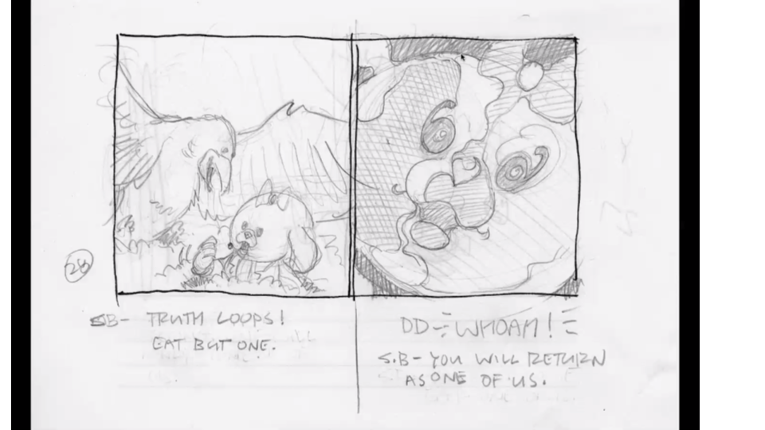{width=867px; height=500px}


## Chapter 4

{width=867px; height=500px}

{width=867px; height=500px}

{width=867px; height=500px}

{width=867px; height=500px}

{width=867px; height=500px}

## Chapter 5

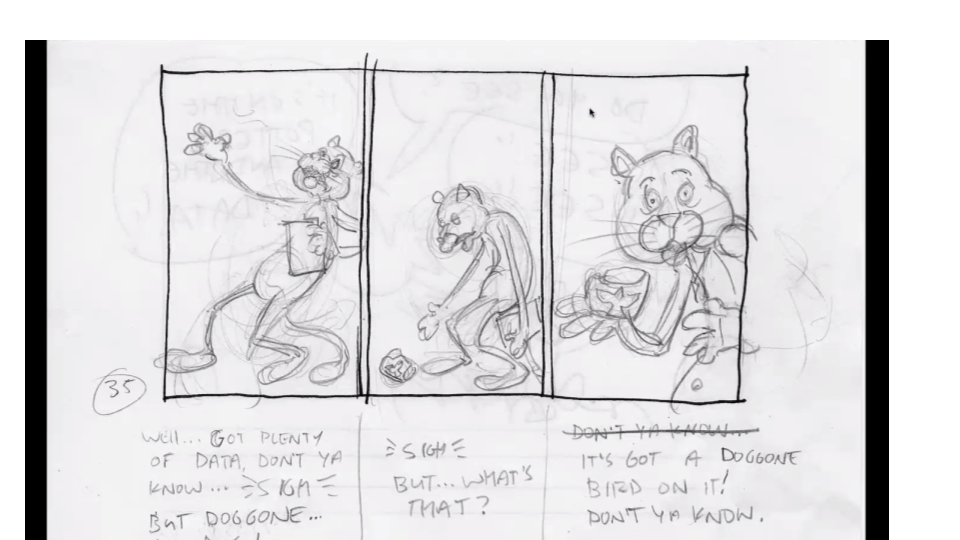{width=867px; height=500px}

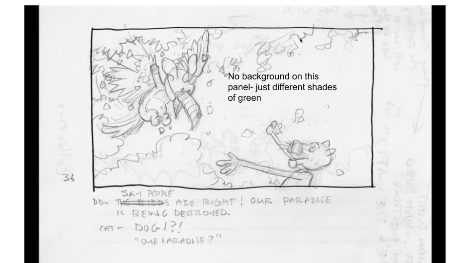{width=867px; height=500px}

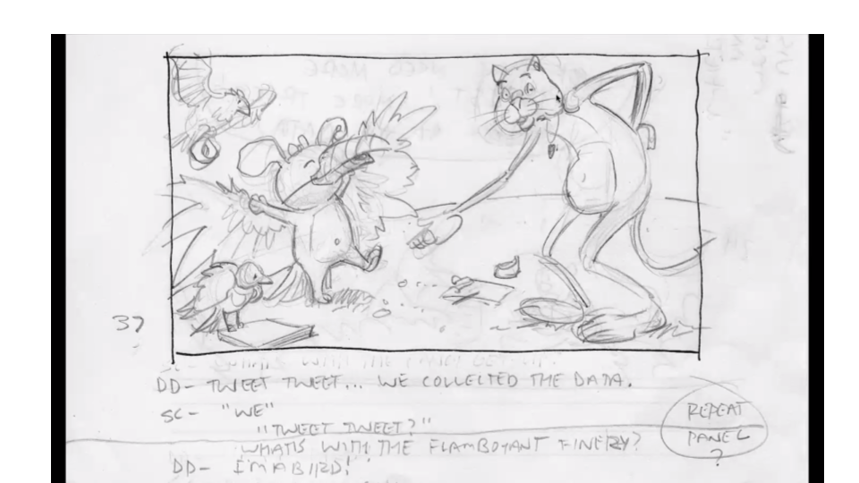{width=867px; height=500px}

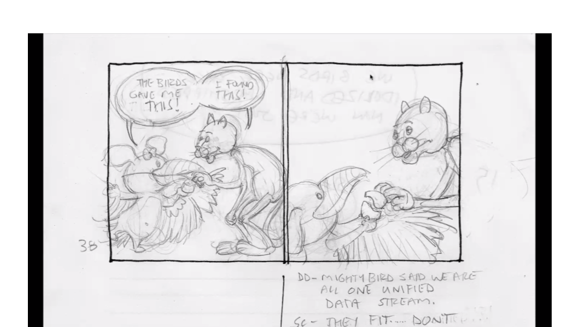{width=867px; height=500px}

{width=867px; height=500px}

<strong>StatCat and DataDog merge their datasets together and start exploring the data by looking at a species richness graph.</strong> 

```{r example6, exercise=TRUE, exercise.setup="setup3", exercise.lines=10, message=FALSE, warning=FALSE}

#Read in the data from StatCat and DataDog
statcat_rich_df <- read.csv('C:/Users/cbolc/Desktop/stories/data/statcat_rich.csv')
datadog_ha_df <- read.csv('C:/Users/cbolc/Desktop/stories/data/datadog_ha.csv')

#View the first few rows of each dataset
head(statcat_rich_df)
head(datadog_ha_df)

#Merge the two datasets together by the variables "site", "block", "elevation", and "habitat"
statcat_datadog_df <- merge(statcat_rich_df, datadog_ha_df, 
                            by = c("site", "block", "elevation", "habitat"))
head(statcat_datadog_df)

```

<strong>Using the merged dataset, let's look at species richness by habitat type to investigate research question 1: What is the relationship between species richness and habitat types (forest, shrubs, trees, fragments, etc.)?</strong>

```{r example7, exercise=TRUE, exercise.setup="setup3", exercise.lines=10, message=FALSE, warning=FALSE}

#boxplot of species richness by habitat types
boxplot(rich ~ habitat, data=statcat_datadog_df,
        main = "Species Richness by Habitat Type",
        xlab = "Habitat Type",
        ylab = "Species Richness")

```

<strong>When interpreting a boxplot, remember that the soild black line is the median value, the box indicates the values for the first and third quartiles (IQR = Q3-Q1), nd the whiskers with the dotted lines indicate the minimum and maximum values.</strong>

<strong> Comprehension Questions </strong>
```{r example8, exercise=TRUE, exercise.setup="setup3", exercise.lines=5, message=FALSE, warning=FALSE}

#Question 1
#What habitat type has the highest median species richness?


```

```{r example8-solution}

#The habitat type with the largest median species richness is forest.

```


```{r example9, exercise=TRUE, exercise.setup="setup3", exercise.lines=5, message=FALSE, warning=FALSE}

#Question 2
#What is the IQR for the "fragment" habitat type?


```

```{r example9-hint}

"Try using the functions group_by(), summarise(), and IQR()."

```


```{r example9-solution}

#We need to group by habitat and use IQR() in the summarise() function for calculating the IQR of rich
statcat_datadog_df %>%
  group_by(habitat) %>%
  summarise(IQR = IQR(rich))

```


```{r example10, exercise=TRUE, exercise.lines=5, message=FALSE, warning=FALSE}

#Question 3
#Change the color of the boxes in the boxplot to green using the function col = c() in the boxplot code 


```

```{r example10-solution}

#Boxplot with green boxes
boxplot(rich ~ habitat, data=statcat_datadog_df,
        main = "Species Richness by Habitat Type",
        xlab = "Habitat Type",
        ylab = "Species Richness",
        col=(c("green")))

```


## Chapter 6

{width=867px; height=500px}

## Chapter 7

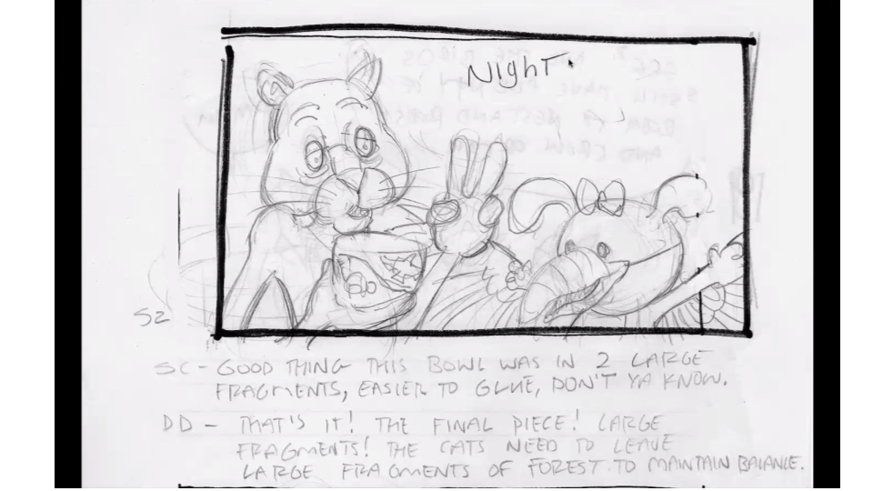{width=867px; height=500px}

{width=867px; height=500px}

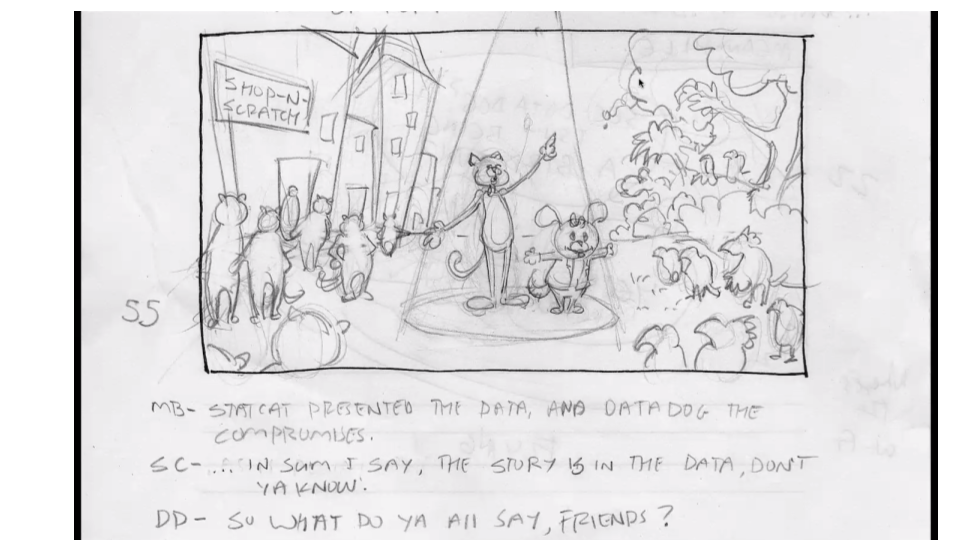{width=867px; height=500px}

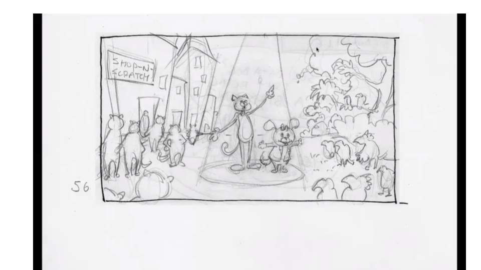{width=867px; height=500px}

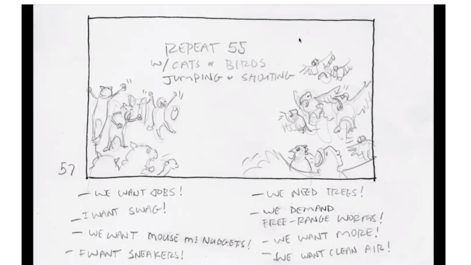{width=867px; height=500px}

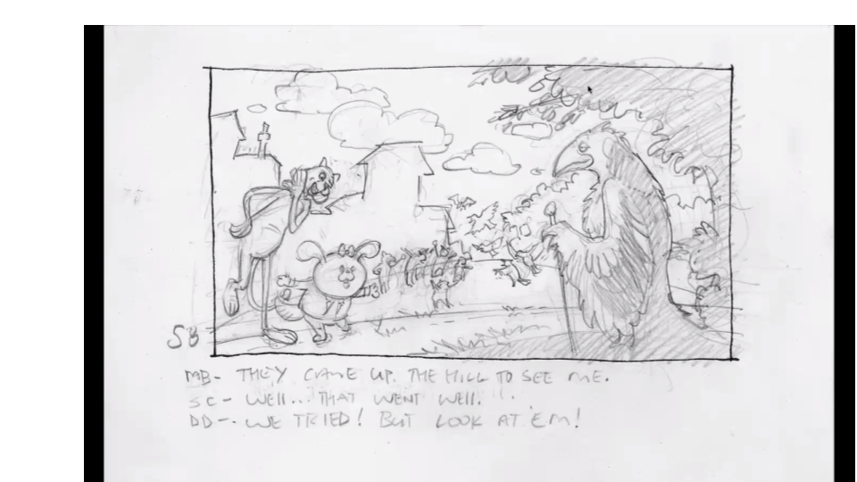{width=867px; height=500px}

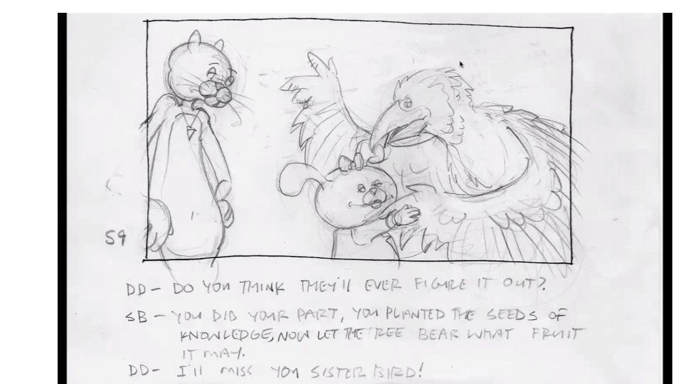{width=867px; height=500px}

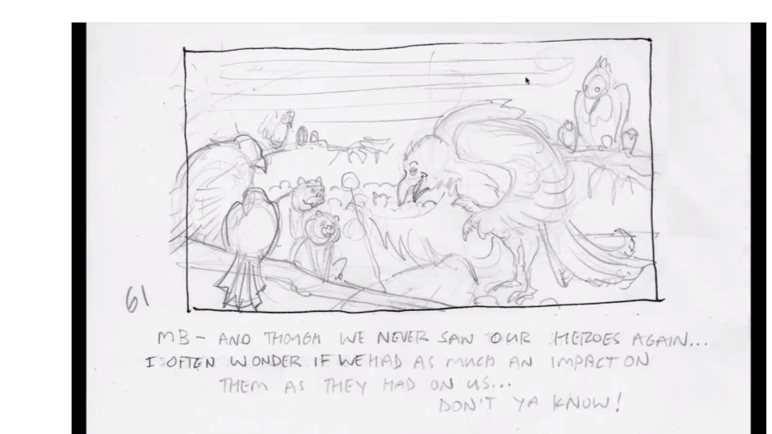{width=867px; height=500px}

{width=867px; height=500px}
